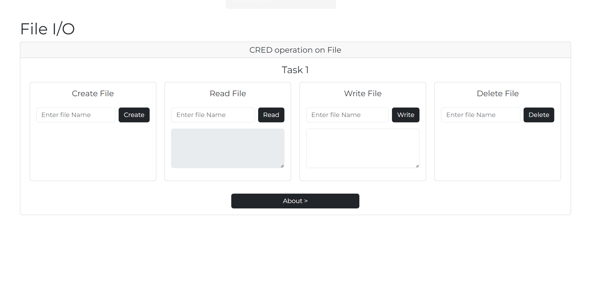

# File I/O Operations with Node.js

This project allows users to perform basic CRUD (Create, Read, Update, Delete) operations on files in a Node.js environment. The operations are accessible via a web interface and use the Express framework to handle requests.

## Features

- **Create a File**: Allows the user to create an empty file by providing a file name.
- **Read a File**: Displays the content of a file based on the provided file name.
- **Write to a File**: Updates the content of a file with the provided text.
- **Delete a File**: Deletes a specified file from the system.
- **Interactive UI**: A user-friendly interface built with Bootstrap to manage files.

## Technologies Used

- **Backend:**
  - Node.js
  - Express.js
  - EJS (Embedded JavaScript) for dynamic templating
  - File System (fs) module for file operations
- **Frontend:**
  - HTML5
  - CSS3
  - Bootstrap 5 for styling

## Project Setup

### 1. Clone the Repository

```bash
git clone <repository_url>
cd File-Upload-Nodejs
```

### 2. Install Dependencies

Run the following command to install the necessary dependencies:

```bash
npm install
```

### 3. Run the Application

Start the server by running the following command:

```bash
npm start
```

This will start the application on `http://localhost:3000`.

### 4. Access the Application

Open a browser and go to `http://localhost:3000` to start performing file operations.

## File Operations

1. **Create a File**:  
   - Enter the file name and click **Create** to create an empty file.

2. **Read a File**:  
   - Enter the file name and click **Read** to view the file's content. The content will be displayed in a text area.

3. **Write to a File**:  
   - Enter the file name and text to write to the file, then click **Write** to update the file's content.

4. **Delete a File**:  
   - Enter the file name and click **Delete** to remove the file from the server.

## Folder Structure

```
File-Upload-Nodejs/
├── bin/
│   └── www                 # Entry point for the server
├── public/
│   └── stylesheets/
│       └── style.css       # Custom styles
├── routes/
│   ├── index.js            # Main file operations
│   └── users.js            # Example user route (can be deleted if not needed)
├── upload/                 # Folder where files are stored
├── views/
│   ├── index.ejs           # Home page template
│   ├── error.ejs           # Error page template
│   └── about.ejs           # About page template
├── app.js                  # Express app setup
├── package.json            # Project metadata and dependencies
└── README.md               # Project documentation
```

## Screenshots



## Credits

- **Developer:** Yash Kolte
- **Technologies:** Node.js, Express, EJS, Bootstrap, File System

## License

This project is licensed under the MIT License - see the [LICENSE](LICENSE) file for details.
